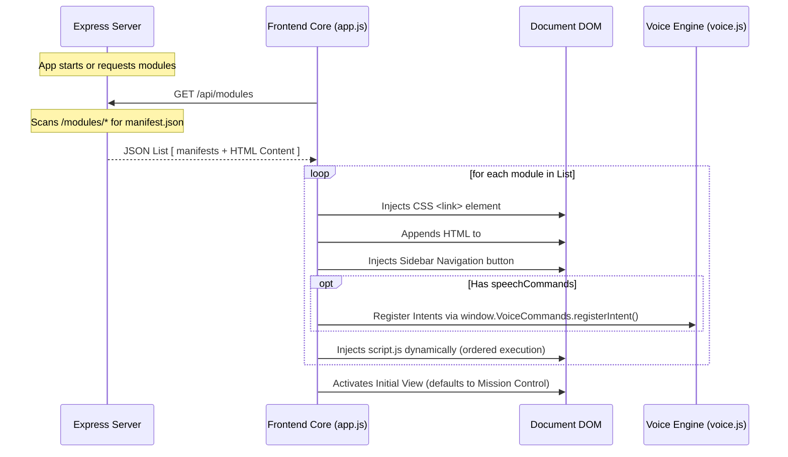

# Vibes Dashboard — Modular Framework Specification

This document details the architecture, registration lifecycle, API integration, and security guidelines for extending the **Vibes Dashboard**. By adhering to this specification, developers and AI agents can build and seamlessly integrate new visual panels, control dashboards, or background widgets.

---

## 🗺 System Architecture Overview

The Vibes Dashboard is structured as a **pluggable, single-page application** powered by an Express/Node.js backend and a vanilla JavaScript frontend. 

Modules are discovered dynamically on the server-side, loaded dynamically on the client-side, and run within the host page layout while benefiting from standard styling conventions and real-time state synchronizations.



---

## 📂 Module Directory Structure

Every module must reside in its own subdirectory inside the global `/modules` directory at the project root:

```text
/modules
└── [module-id]/
    ├── manifest.json      # Required metadata and routing mapping
    ├── view.html          # Required structural layout (HTML fragment)
    ├── style.css          # Optional module-specific styling
    └── script.js          # Optional module-specific controller logic
```

---

## 📋 Manifest Schema Definition (`manifest.json`)

The `manifest.json` file is the entrypoint for module registration. Below is the JSON Schema representation alongside detailed property descriptions.

### JSON Schema (Draft-07)
You can reference this schema in your workspace to enable automatic IDE linting and autocompletion:

```json
{
  "$schema": "http://json-schema.org/draft-07/schema#",
  "title": "VibesDashboardModuleManifest",
  "type": "object",
  "required": ["id", "name", "icon", "html"],
  "properties": {
    "id": {
      "type": "string",
      "description": "Unique identifier for the module (matches the folder name and DOM IDs)."
    },
    "name": {
      "type": "string",
      "description": "The user-facing title of the module displayed in headers and sidebar tooltips."
    },
    "subtitle": {
      "type": "string",
      "description": "Sub-header description displayed at the top of the viewport when active."
    },
    "icon": {
      "type": "string",
      "description": "Raw SVG markup containing the inline graphic to render in the sidebar button. Must use currentColor for stroke/fill styling."
    },
    "css": {
      "type": "string",
      "description": "Path to the CSS stylesheet relative to the module folder root (typically 'style.css')."
    },
    "html": {
      "type": "string",
      "description": "Path to the HTML template fragment file relative to the module folder root (typically 'view.html')."
    },
    "js": {
      "type": "string",
      "description": "Path to the JavaScript controller file relative to the module folder root (typically 'script.js')."
    },
    "dependencies": {
      "type": "array",
      "items": { "type": "string" },
      "description": "List of module IDs that must be loaded before this module."
    },
    "useShadowDOM": {
      "type": "boolean",
      "default": false,
      "description": "If true, the module view will be encapsulated in a Shadow Root for CSS/DOM isolation."
    },
    "speechCommands": {
      "type": "array",
      "description": "Speech command intents that hook into the global audio/voice controls.",
      "items": {
        "type": "object",
        "required": ["intent", "triggers"],
        "properties": {
          "intent": {
            "type": "string",
            "description": "Global unique identifier for this speech command (e.g. 'NAV_BROWSER')."
          },
          "triggers": {
            "type": "array",
            "items": {
              "type": "string"
            },
            "description": "Spoken wake phrases/keywords that activate this module."
          },
          "label": {
            "type": "string",
            "description": "Optional human-readable label displayed in the voice commands list."
          },
          "icon": {
            "type": "string",
            "description": "Optional emoji or character representing this voice command action."
          }
        }
      }
    }
  }
}
```

### Property Reference

| Property Name | Type | Required | Description |
| :--- | :--- | :--- | :--- |
| `id` | `string` | **Yes** | Standard identifier (e.g., `web-browser`). Matches the folder name. |
| `name` | `string` | **Yes** | Readable module title (e.g., `Web Browser`). |
| `subtitle` | `string` | No | Secondary title (e.g., `Integrated Sandbox Web Explorer`). |
| `icon` | `string` | **Yes** | Raw HTML inline `<svg>` string. Use standard layout bounds `viewBox="0 0 24 24"`. |
| `css` | `string` | No | Relative path to stylesheet file (e.g., `style.css`). |
| `html` | `string` | **Yes** | Relative path to layout template (e.g., `view.html`). |
| `js` | `string` | No | Relative path to logic controller script (e.g., `script.js`). |
| `dependencies` | `array` | No | List of module IDs that must be loaded first. |
| `useShadowDOM` | `boolean` | No | Enable Shadow DOM encapsulation (isolation mode). |
| `speechCommands` | `array` | No | List of voice intent definitions to route back to this module. |

---

## 📡 Interaction Patterns & Lifecycle

### 3.1 Global Dashboard Namespace
Modules interact with the core via the `window.Dashboard` object.

### 3.2 Advanced Lifecycle Registration
For robust modules that manage background tasks (visualizers, intervals, sockets), use the `registerModuleLogic` API.

```javascript
window.Dashboard.registerModuleLogic('my-module-id', {
  /**
   * onInit: Called once after the module script and HTML are injected.
   * @param {HTMLElement|ShadowRoot} panel - The root container for the module.
   */
  onInit: (panel) => {
    // Initial DOM binding
  },

  /**
   * onActivate: Called whenever the module view becomes active.
   */
  onActivate: () => {
    // Resume animations/timers
  },

  /**
   * onDeactivate: Called when user switches to another module.
   */
  onDeactivate: () => {
    // Pause CPU-intensive tasks
  }
});
```

---

## 🎨 Styling & Aesthetic Guidelines (Glassmorphism)

To maintain a sleek, premium, and visually cohesive user interface, all custom modules must leverage the dashboard's design system tokens and glassmorphism directives.

### CSS Variables Available
Your custom stylesheets can reference global CSS custom properties defined in `index.css`:

```css
/* Color System */
var(--bg-glass)          /* Transparent white/dark base for panels */
var(--border-glass)      /* Soft bordering for frosted outlines */
var(--glow-color)        /* Dynamic theme accent colors */
var(--text-main)         /* Clean high-contrast white text */
var(--text-muted)        /* Soft gray font color */

/* Fonts */
font-family: 'Outfit', sans-serif;
font-family: 'Inter', sans-serif;
```

### Shadow DOM (Isolation Mode)
By setting `"useShadowDOM": true` in the manifest, the core loader will wrap the module view in a Shadow Root. 
- **Pros**: Complete CSS isolation. Your styles won't bleed out, and global styles (mostly) won't bleed in.
- **Cons**: Standard global CSS variables still apply, but some global utility classes might not be available inside the shadow.

---

## 🔒 Mandatory Security Guidelines

Because all modules execute in the top-level window context, security is paramount. Avoid introducing cross-site scripting (XSS) or DOM modification bugs by adhering to the following restrictions:

### 1. DOM Injection Safety (No `innerHTML`)
* **CRITICAL**: Never use `innerHTML`, `outerHTML`, `insertAdjacentHTML`, or `document.write` to render dynamic data, user inputs, database responses, or command logs.
* **Text Insertion**: Use `textContent` or `innerText` to safely output text variables.
* **Component Construction**: Build elements using `document.createElement()`, `setAttribute()`, and `appendChild()`.
* **Clearing Elements**: Use `element.replaceChildren()` instead of setting `innerHTML = ''`.
* **Static Vector/SVG Graphics**: To insert inline SVGs or complex layouts securely without executing malicious scripts, use the browser's built-in `DOMParser` to sanitize content:
  ```javascript
  // SECURE static SVG injection
  const svgParser = new DOMParser();
  const svgDoc = svgParser.parseFromString(rawSvgString, 'image/svg+xml');
  targetContainer.appendChild(svgDoc.documentElement);
  ```

---

## 📝 Walkthrough: Creating a Custom Module ("System Monitor")

Here is a step-by-step example showing how to build a basic system monitoring tab.

### Step 1: Create the directory
Create `modules/sys-monitor/`.

### Step 2: Define `modules/sys-monitor/manifest.json`
```json
{
  "id": "sys-monitor",
  "name": "System Monitor",
  "subtitle": "Host Hardware Telemetry",
  "icon": "<svg viewBox=\"0 0 24 24\" fill=\"none\" stroke=\"currentColor\" stroke-width=\"2\"><rect x=\"2\" y=\"2\" width=\"20\" height=\"8\" rx=\"2\" /><rect x=\"2\" y=\"14\" width=\"20\" height=\"8\" rx=\"2\" /><line x1=\"6\" y1=\"6\" x2=\"6.01\" y2=\"6\" /><line x1=\"6\" y1=\"18\" x2=\"6.01\" y2=\"18\" /></svg>",
  "css": "style.css",
  "html": "view.html",
  "js": "script.js"
}
```

### Step 3: Define `modules/sys-monitor/script.js`
```javascript
(function () {
  'use strict';

  let cpuInterval = null;

  window.Dashboard.registerModuleLogic('sys-monitor', {
    onInit: (panel) => {
      console.log('Telemetry system online');
    },
    onActivate: () => {
      cpuInterval = setInterval(() => {
        const usage = Math.floor(Math.random() * 100);
        document.getElementById('cpu-text').textContent = `${usage}%`;
      }, 2000);
    },
    onDeactivate: () => {
      clearInterval(cpuInterval);
    }
  });
})();
```
