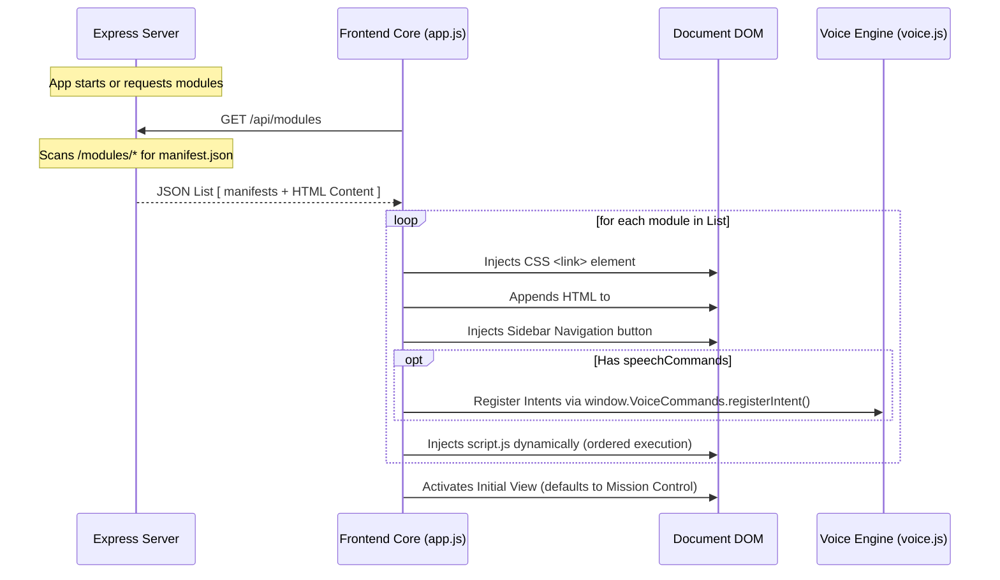

# Vibes Dashboard — Modular Framework Specification

This document details the architecture, registration lifecycle, API integration, and security guidelines for extending the **Vibes Dashboard**. By adhering to this specification, developers and AI agents can build and seamlessly integrate new visual panels, control dashboards, or background widgets.

---

## 🗺 System Architecture Overview

The Vibes Dashboard is structured as a **pluggable, single-page application** powered by an Express/Node.js backend and a vanilla JavaScript frontend. 

Modules are discovered dynamically on the server-side, loaded dynamically on the client-side, and run within the host page layout while benefiting from standard styling conventions and real-time state synchronizations.



---

## 📂 Module Directory Structure

Every module must reside in its own subdirectory inside the global `/modules` directory at the project root:

```text
/modules
└── [module-id]/
    ├── manifest.json      # Required metadata and routing mapping
    ├── view.html          # Required structural layout (HTML fragment)
    ├── style.css          # Optional module-specific styling
    └── script.js          # Optional module-specific controller logic
```

---

## 📋 Manifest Schema Definition (`manifest.json`)

The `manifest.json` file is the entrypoint for module registration. Below is the JSON Schema representation alongside detailed property descriptions.

### JSON Schema (Draft-07)
You can reference this schema in your workspace to enable automatic IDE linting and autocompletion:

```json
{
  "$schema": "http://json-schema.org/draft-07/schema#",
  "title": "VibesDashboardModuleManifest",
  "type": "object",
  "required": ["id", "name", "icon", "html"],
  "properties": {
    "id": {
      "type": "string",
      "description": "Unique identifier for the module (matches the folder name and DOM IDs)."
    },
    "name": {
      "type": "string",
      "description": "The user-facing title of the module displayed in headers and sidebar tooltips."
    },
    "subtitle": {
      "type": "string",
      "description": "Sub-header description displayed at the top of the viewport when active."
    },
    "icon": {
      "type": "string",
      "description": "Raw SVG markup containing the inline graphic to render in the sidebar button. Must use currentColor for stroke/fill styling."
    },
    "css": {
      "type": "string",
      "description": "Path to the CSS stylesheet relative to the module folder root (typically 'style.css')."
    },
    "html": {
      "type": "string",
      "description": "Path to the HTML template fragment file relative to the module folder root (typically 'view.html')."
    },
    "js": {
      "type": "string",
      "description": "Path to the JavaScript controller file relative to the module folder root (typically 'script.js')."
    },
    "speechCommands": {
      "type": "array",
      "description": "Speech command intents that hook into the global audio/voice controls.",
      "items": {
        "type": "object",
        "required": ["intent", "triggers"],
        "properties": {
          "intent": {
            "type": "string",
            "description": "Global unique identifier for this speech command (e.g. 'NAV_BROWSER')."
          },
          "triggers": {
            "type": "array",
            "items": {
              "type": "string"
            },
            "description": "Spoken wake phrases/keywords that activate this module."
          },
          "label": {
            "type": "string",
            "description": "Optional human-readable label displayed in the voice commands list."
          },
          "icon": {
            "type": "string",
            "description": "Optional emoji or character representing this voice command action."
          }
        }
      }
    }
  }
}
```

### Property Reference

| Property Name | Type | Required | Description |
| :--- | :--- | :--- | :--- |
| `id` | `string` | **Yes** | Standard identifier (e.g., `web-browser`). Matches the folder name. |
| `name` | `string` | **Yes** | Readable module title (e.g., `Web Browser`). |
| `subtitle` | `string` | No | Secondary title (e.g., `Integrated Sandbox Web Explorer`). |
| `icon` | `string` | **Yes** | Raw HTML inline `<svg>` string. Use standard layout bounds `viewBox="0 0 24 24"`. |
| `css` | `string` | No | Relative path to stylesheet file (e.g., `style.css`). |
| `html` | `string` | **Yes** | Relative path to layout template (e.g., `view.html`). |
| `js` | `string` | No | Relative path to logic controller script (e.g., `script.js`). |
| `speechCommands` | `array` | No | List of voice intent definitions to route back to this module. |

---

## 🚀 Module Loading Lifecycle

When the main client application initializes, it executes the following sequential steps:

1. **Discovery Request**: The client requests `/api/modules` from the Express server.
2. **Backend Scan**:
   - The backend checks each child directory in `/modules` for `manifest.json`.
   - If found, it reads the manifest, resolves file paths, reads the specified `html` file, and attaches it as `htmlContent`.
3. **Frontend Insertion**:
   - **Stylesheets**: Appended to the document `<head>` dynamically.
   - **View Panels**: A new wrapper `.view-panel.main-view.hidden` is created with an ID format of `view-[module-id]`. Its inner HTML is filled with the module's `htmlContent` and appended to `#views-container`.
   - **Navigation Buttons**: A button is injected into the sidebar navigation bar with the SVG content. It is hooked to display the view when clicked.
   - **Speech Commands**: Triggers are registered into the global `window.VoiceCommands` dictionary.
   - **Scripts**: The javascript controller is loaded asynchronously using script injection (`async = false` to guarantee ordered execution if multiple scripts depend on each other).

---

## 🎛 Global SDK & API Integration

When writing your module's `script.js`, your code runs in the context of the main page. A global namespace `window.Dashboard` is exposed to allow custom logic interaction.

### `window.Dashboard` Namespace

```javascript
// Access the global socket connection
const socket = window.Dashboard.socket; 

// Access active agent states
const activeAgents = window.Dashboard.agents; // JS Map<agentId, agentObject>

// Show a specific module's panel programmatically
window.Dashboard.showView('orchestrator');
```

### Global Custom Events
Your module scripts can listen to system events dispatched on the `document` object:

| Event Name | Detail Payload (`e.detail`) | Trigger Condition |
| :--- | :--- | :--- |
| `dashboard:view-changed` | `{ id: "module-id" }` | Fired when a different view is activated. |
| `dashboard:agents-snapshot` | `[ agentObjects ]` | Fired on client connection with initial agent statuses. |
| `dashboard:agent-created` | `agentObject` | Fired when a new agent mission is initialized. |
| `dashboard:agent-updated` | `agentObject` | Fired when an agent changes status, reports progress, or triggers an alert. |
| `dashboard:agent-removed` | `{ id: "agent-id" }` | Fired when an agent is closed or terminated. |
| `dashboard:agent-log` | `{ id: "agent-id", log: "message" }` | Fired when a command or background agent outputs logs. |

*Example script setup:*
```javascript
(function () {
  'use strict';

  // Perform setup when our view is loaded
  document.addEventListener('DOMContentLoaded', () => {
    const myPanel = document.getElementById('view-my-module');
    if (!myPanel) return;

    // Listen to agent updates to refresh telemetry UI
    document.addEventListener('dashboard:agent-updated', (e) => {
      const updatedAgent = e.detail;
      console.log(`Telemetry updated for ${updatedAgent.mission}: ${updatedAgent.progress}%`);
    });
  });
})();
```

---

## 🎨 Styling & Aesthetic Guidelines (Glassmorphism)

To maintain a sleek, premium, and visually cohesive user interface, all custom modules must leverage the dashboard's design system tokens and glassmorphism directives.

### CSS Variables Available
Your custom stylesheets can reference global CSS custom properties defined in `index.css`:

```css
/* Color System */
var(--bg-glass)          /* Transparent white/dark base for panels */
var(--border-glass)      /* Soft bordering for frosted outlines */
var(--glow-color)        /* Dynamic theme accent colors */
var(--text-main)         /* Clean high-contrast white text */
var(--text-muted)        /* Soft gray font color */

/* Fonts */
font-family: 'Outfit', sans-serif;
font-family: 'Inter', sans-serif;
```

### Premium UI Component Scaffold
Below is a reference snippet showing how to style a container to conform to the glassmorphic theme:

```css
.my-module-panel {
  background: var(--bg-glass);
  backdrop-filter: blur(12px);
  -webkit-backdrop-filter: blur(12px);
  border: 1px solid var(--border-glass);
  border-radius: 16px;
  box-shadow: 0 8px 32px 0 rgba(0, 0, 0, 0.3);
  padding: 24px;
  color: var(--text-main);
  transition: all 0.3s cubic-bezier(0.4, 0, 0.2, 1);
}

.my-module-panel:hover {
  border-color: rgba(255, 255, 255, 0.2);
  box-shadow: 0 8px 32px 0 var(--glow-color);
}
```

---

## 🔒 Mandatory Security Guidelines

Because all modules execute in the top-level window context, security is paramount. Avoid introducing cross-site scripting (XSS) or DOM modification bugs by adhering to the following restrictions:

### 1. DOM Injection Safety (No `innerHTML`)
* **CRITICAL**: Never use `innerHTML`, `outerHTML`, `insertAdjacentHTML`, or `document.write` to render dynamic data, user inputs, database responses, or command logs.
* **Text Insertion**: Use `textContent` or `innerText` to safely output text variables.
* **Component Construction**: Build elements using `document.createElement()`, `setAttribute()`, and `appendChild()`.
* **Clearing Elements**: Use `element.replaceChildren()` instead of setting `innerHTML = ''`.
* **Static Vector/SVG Graphics**: To insert inline SVGs or complex layouts securely without executing malicious scripts, use the browser's built-in `DOMParser` to sanitize content:
  ```javascript
  // SECURE static SVG injection
  const svgParser = new DOMParser();
  const svgDoc = svgParser.parseFromString(rawSvgString, 'image/svg+xml');
  targetContainer.appendChild(svgDoc.documentElement);
  ```

### 2. Sandbox Isolation for Web Views
If your module loads frames or remote web portals, always apply strict sandbox rules:
* Always include the `sandbox` attribute on `<iframe>` tags.
* **WARNING**: Never combine `allow-scripts` and `allow-same-origin` inside an iframe loading untrusted remote content, as this allows the guest site to escape its sandbox and control the top-level parent window.

---

## 📝 Walkthrough: Creating a Custom Module ("System Monitor")

Here is a step-by-step example showing how to build a basic system monitoring tab.

### Step 1: Create the directory
Create `modules/sys-monitor/`.

### Step 2: Define `modules/sys-monitor/manifest.json`
```json
{
  "id": "sys-monitor",
  "name": "System Monitor",
  "subtitle": "Host Hardware Telemetry",
  "icon": "<svg viewBox=\"0 0 24 24\" fill=\"none\" stroke=\"currentColor\" stroke-width=\"2\"><rect x=\"2\" y=\"2\" width=\"20\" height=\"8\" rx=\"2\" /><rect x=\"2\" y=\"14\" width=\"20\" height=\"8\" rx=\"2\" /><line x1=\"6\" y1=\"6\" x2=\"6.01\" y2=\"6\" /><line x1=\"6\" y1=\"18\" x2=\"6.01\" y2=\"18\" /></svg>",
  "css": "style.css",
  "html": "view.html",
  "js": "script.js",
  "speechCommands": [
    {
      "intent": "NAV_TELEMETRY",
      "triggers": ["show telemetry", "go to telemetry", "telemetry", "system monitor"],
      "label": "Show Telemetry",
      "icon": "📊"
    }
  ]
}
```

### Step 3: Define `modules/sys-monitor/view.html`
```html
<div class="monitor-grid">
  <div class="monitor-card glass">
    <h3>CPU Utilization</h3>
    <div class="progress-bar">
      <div id="cpu-bar" class="progress-fill" style="width: 0%"></div>
    </div>
    <span id="cpu-text" class="stat-value">0%</span>
  </div>
</div>
```

### Step 4: Define `modules/sys-monitor/style.css`
```css
.monitor-grid {
  display: grid;
  grid-template-columns: repeat(auto-fit, minmax(280px, 1fr));
  gap: 20px;
  padding: 20px;
}

.monitor-card {
  padding: 24px;
  border-radius: 16px;
  border: 1px solid var(--border-glass);
  background: var(--bg-glass);
}

.progress-bar {
  width: 100%;
  height: 8px;
  background: rgba(255, 255, 255, 0.1);
  border-radius: 4px;
  overflow: hidden;
  margin: 12px 0;
}

.progress-fill {
  height: 100%;
  background: var(--glow-color);
  transition: width 0.5s ease-out;
}
```

### Step 5: Define `modules/sys-monitor/script.js`
```javascript
(function () {
  'use strict';

  document.addEventListener('DOMContentLoaded', () => {
    const cpuBar = document.getElementById('cpu-bar');
    const cpuText = document.getElementById('cpu-text');

    if (!cpuBar || !cpuText) return;

    // Simulate real-time hardware polling
    setInterval(() => {
      // Only update if our view is currently active
      if (window.Dashboard.activeModuleId !== 'sys-monitor') return;

      const randomUsage = Math.floor(Math.random() * 100);
      
      // Update UI securely using textContent
      cpuText.textContent = `${randomUsage}%`;
      cpuBar.style.width = `${randomUsage}%`;
    }, 2000);
  });
})();
```
